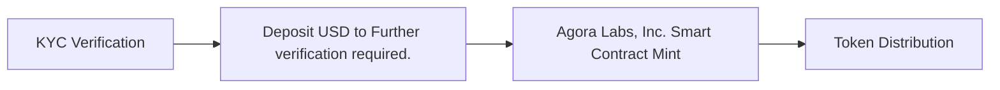
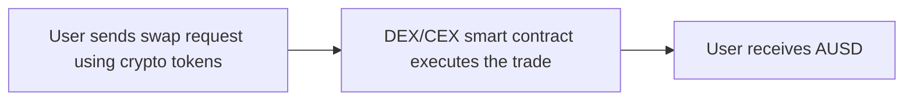
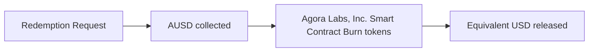
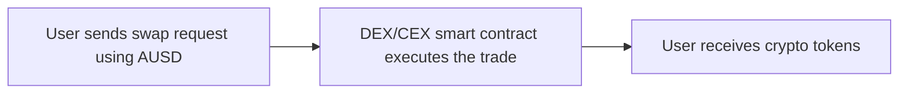
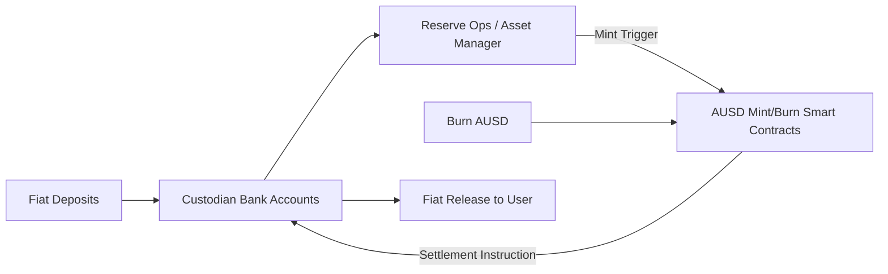

### Stablecoin Fundamentals

Short overview: This section evaluates AUSD's purpose, reserve model, issuance/redemption mechanics, and governance, framed through risk. Key exposures include custody concentration, redemption friction, upgrade authority, and regulatory posture.

## 1.1 Description of the Stablecoin

### 1.1.1 Stablecoin Classification

AUSD is analyzed as a Fiat-backed stablecoin. The reserve structure (Cash (https://example.com), U.S. Treasuries) determines redemption reliability and regulatory profile: higher-quality, short-duration assets improve liquidity during stress but can embed interest rate and counterparty risks. Clarity on governance (Proxy-admin multisig (Further verification required)) and regulatory approach (Attestations and compliance controls (Further verification required)) affects institutional adoption. Strengths include simplicity and potential transparency; residual risks center on custodial dependencies, concentration in few institutions, and administrative control over mint/burn.

AUSD Classification Snapshot (source: FVR)

| classification criteria | AUSD details |
| --- | --- |
| Primary Type | Fiat-backed |
| Backing Ratio | 1:1 USD (Further verification required) |
| Reserve Assets | Cash (https://example.com), U.S. Treasuries |
| Peg Mechanism | Pegged to USD via redemption/mint parity |
| Redemption Model | Institutional primary redemption; retail via CEX/DEX |
| AUSD Custodian | Further verification required. |
| AUSD Asset Manager | Further verification required. |
| Governance Structure | Proxy-admin multisig (Further verification required) |
| Regulatory Approach | Attestations and compliance controls (Further verification required) |

Simple comparison to other Fiat-backed stablecoins: Position AUSD versus peers (e.g., USDC, USDT, DAI) on reserve quality, disclosures, and governance. Where disclosures lag, adoption may be constrained.

### 1.1.2  User Adoption & Accessibility

Minting eligibility and access pathways shape who bears redemption frictions. KYC’d institutions can mint/redeem directly (FVR). Institutions may access primary issuance; retail typically acquires via secondary markets and CeFi/DeFi rails. Retail uses exchanges and DEXs (FVR).

- Institutional Access
- Retail Access

Minting Platforms/Access Points and KYC requirements

| category | examples ( bulletpoints) | Access type | KYC required (indicate the KYC required and be precise) |
| --- | --- | --- | --- |
| Institutional Counterpart | - Direct issuer portal | Primary issuance | Full KYC/AML |
| Centralize exchanges | - CEX listings | Secondary | Exchange KYC |
| Retail swaps | - Uniswap pool | Secondary | None on-chain; front-end may vary |

Fiat on/off ramps

Key risk is dependency on banking partners; outages or de-risking can delay redemptions and widen peg spreads.

- Bank wires (FVR)
- Payment partners (FVR)

Supported wallets

Wallet support influences key management risks and end-user accessibility.

- EVM-Compatible Wallets
  - Metamask
  - Rabbi
- Solana Ecosystem Wallets
  - Phantom
- Sui Network Wallets
  - Sui Wallet
- Multi-Chain Solutions
  - Ledger
  - Fireblocks
- Institutional Custody Wallets
  - Anchorage
  - Coinbase Custody

**Geographic Accessibility**

Global in principle; restrictions may apply to sanctioned regions (FVR).

Friction points for onboarding

Compliance, venue fragmentation, and custody setup can slow adoption.

- Institutional onboarding time
- Venue fragmentation
- Banking-hour dependent redemptions

### 1.1.3 User Flow

Acquisition typically occurs via primary mint (institutions) or secondary markets (retail). Redemption mirrors this: primary redemptions against reserves, secondary via CEX/DEX liquidity with price impact.

Acquiring AUSD

- Institutional User
Short narrative: KYC with Agora Labs, Inc.; deposit fiat to asset manager; on-chain mint; settlement.

- Retail User
Short narrative: Swap on DEX/CEX using available pairs; custody in supported wallet.

Redeeming AUSD

- Institutional User
Short narrative: Burn tokens on-chain; fiat released via banking rails, subject to partner SLAs.

- Retail User
Short narrative: Swap AUSD on DEX/CEX back into crypto/fiat; price depends on liquidity depth.

### 1.1.4 Reserves Overview

Further verification required.

- Further verification required.

### 1.1.5 Fees and Business Model

Fee Model

Further verification required.

| Name | Description | Rate |
| --- | --- | --- |

Alternative Revenue Streams

| revenue stream | descritption |
| --- | --- |

Executive summary

- Revenue Oversight
  - Revenue Allocation and Usage: Further verification required.
  - Partner Revenue Sharing: Further verification required.
  - Corporate Revenue Usage: Further verification required.

Strategic Value Creation

Further verification required.

### 1.1.6 Ecosystem & Governance Overview

Legal Entity & Incorporation

- Full Legal Name:  Agora Labs, Inc.
- Incorporation (State/Country & Type): Further verification required.
- DBA / Operating Name: Agora Finance
- Mission / Purpose: Further verification required.
- Profit Status: For-profit (Further verification required)
- Legal Constraints / Charter Obligations: Further verification required.

Ownership & Beneficiaries

Further verification required.

Governance & Oversight

Further verification required.

Management & Operations

Further verification required.

Key Executives / Founders

Further verification required.

### 1.1.7 History

Significant updates can alter risk, especially around reserve policy, custody, governance, and cross-chain support.

Further verification required.

## 1.2 System Architecture Overview

### 1.2.1 Background Workflow

Fiat deposits into custodian accounts prompt mint signals to the on-chain controller contract; redemptions burn tokens and release fiat from reserves (FVR).

### 1.2.2 Architecture Diagram

### 1.2.3 Key Technical Components

- Cross-chain Architecture
Ethereum (FVR) is the native chain; bridging via Further verification required. to Arbitrum, Polygon. Token types and behavior vary per chain and may affect integration risk.

| token type | description |
| --- | --- |
| ERC-20 | Native representation on Ethereum (FVR) |

- Lockbox & Custodial Mechanisms
Roles: Controller, Treasury. Type: Multisig-controlled treasury (FVR). Governance: Multisig (FVR). Multisig contracts: 0x0000...FVR.

- Bridging Models and Flow Control
Model: Canonical lock-and-mint (FVR). Flow control: Mint/burn gated by roles (FVR).

- Operational Oversight & Risk Considerations
- Custodian outage
- Bridge exploit
- Admin key compromise

## Section 2: Market Performance & Risk Assessment

This section scopes market footprint, liquidity depth, and peg integrity, highlighting where market microstructure can amplify or mute redemption frictions.

### 2.1 Market Performance Metrics

#### 2.1.1 Outstanding and Free-Float Supply

[CHART PLACEHOLDER]

Describe methodology: define outstanding vs. free-float; exclude treasury/blacklisted holdings; aggregate across chains.

#### 2.1.2 Market Share in Overall Stablecoin Supply

[CHART PLACEHOLDER]

Compare market cap on primary chain versus similar-scale peers to avoid skew. Narrative: rank and share within category.

#### 2.1.3 Supply Distribution

[CHART PLACEHOLDER]

Break down by chain and holder category (exchanges, treasuries, smart contracts).

#### 2.1.4 Transaction Count and Volume

[CHART PLACEHOLDER]

Totals and trend analysis across major chains.

#### 2.1.5 Transfer Value Distribution

[CHART PLACEHOLDER]

Whale vs retail usage profile.

#### 2.1.6 Stablecoin Velocity

[CHART PLACEHOLDER]

Frequency of transfers relative to supply.

#### 2.1.7 Active Users

[CHART PLACEHOLDER]

#### 2.1.8 User Growth

[CHART PLACEHOLDER]

#### 2.1.9 Activity Distribution

[CHART PLACEHOLDER]

Top addresses by activity; concentration across chains.

### 2.2 Peg Stability Metrics

#### 2.2.1 Peg Deviation Frequency

[CHART PLACEHOLDER]

#### 2.2.2 Maximum Peg Deviation

[CHART PLACEHOLDER]

#### 2.2.3 Standard Deviation of Pegged Value

[CHART PLACEHOLDER]

#### 2.2.4 Market Depth at Pegged Value

[CHART PLACEHOLDER]

#### 2.2.5 Peg Recovery Time

[CHART PLACEHOLDER]

#### 2.2.6 Stress Testing Results

[CHART PLACEHOLDER]

### 2.3 Risk Metrics

#### 2.3.1 Collateral Concentration Risk

[CHART PLACEHOLDER]

#### 2.3.3 Redemption Mechanism Risk

[CHART PLACEHOLDER]

#### 2.3.4 Run Risk Metrics

[CHART PLACEHOLDER]

#### 2.3.5 Risk-Return Allocation

[CHART PLACEHOLDER]

## SECTION 3: On-chain Management

Focus on smart-contract design, control surfaces, and operational processes that gate mint/burn and upgrades.

### 3.1 Operational Overview

#### 3.1.1 Smart Contract Structure

AUSD smart contracts: addresses 0x0000...AUSD. Proxy admin owner: 0x0000...ADMIN (FVR). Chain nativity: Ethereum (FVR). Upgradeability: UUPS/Transparent Proxy (FVR).

Mint/burn flow (on-chain focus): Minter 0x0000...MINTER (FVR) exercises mint authorization under defined roles; Burner 0x0000...BURNER (FVR) triggers supply reductions during redemptions or operational adjustments.

Chain deployment details

- Ethereum
- Arbitrum
- Polygon

Bridging protocol: Further verification required.

Bridge counterparty and message risk (FVR).

#### 3.1.2 Smart Contract Controls

Management type: Multisig-administered (FVR). Lockboxes: Treasury multisig (FVR). Roles and permissions delineate operational authority and are central to upgrade and mint security.

Role: DEFAULT_ADMIN_ROLE: 0x0000...ADMIN — Upgrade authority (FVR)
Role: MINTER_ROLE: 0x0000...MINTER — Mint control (FVR)
Role: BURNER_ROLE: 0x0000...BURNER — Burn control (FVR)

### 3.1.3 Dependencies

Banking partners; bridges; CEX liquidity (FVR).

### 3.1.4 Operational Security Practices

Incident Response

Uses Admin multisig can pause/upgrade and rotate keys (FVR) roles to respond to incidents. History reference: No public incidents found (FVR).

### 3.1.5 Oracle Mechanism

If fiat-backed, AUSD peg management relies on off-chain procedures and attestations, not on-chain price oracles. DeFi integrations may still reference ecosystem oracles for pairs involving AUSD.

### 3.2 Development and Security Metrics

Scope developer activity, documentation quality, and security posture.

#### 3.2.1 Development Activity

[GRAPH PLACEHOLDER]

#### 3.2.2 Number of Active Developers

[GRAPH PLACEHOLDER]

#### 3.2.3 Documentation Quality

Developer docs: https://docs.example.com (FVR)
GitHub: https://github.com/example/repo (FVR)

Score using the provided framework and compute composite.

#### 3.2.4 Upgrade Frequency

[DESCRIPTION PLACEHOLDER]

#### 3.2.5 Smart Contract Audits

Audited: No; Updated: FVR; Auditors: FVR; Scope: Core contracts (FVR); Date: FVR

#### 3.2.6 Known Vulnerabilities Count

Further verification required.

#### 3.2.7 Bug Bounty Program Size

no information available

#### 3.2.8 Historical Downtime

no information available

#### 3.2.9 Time-to-Patch Metric

no information available

## Section 4: Regulation & Compliance

Evaluate reserve assurances, governance control, and regulatory obligations that shape legal risk and redemption reliability.

### 4.1 Reserves Oversight & Assurance

#### 4.1.1 Reserve Assets

Executive summary covering Composition, Liquidity, Quality, Transparency. Use FVR and FVR where available.

Custodians: FVR Custodian (Regulated (FVR)). Assets held per custodian should be disclosed with protections (e.g., insurance) where applicable.

Audit Results / Credentials: Indicate audit/attestation status and providers; cite documents.

#### 4.1.2 Overcollateralization Buffer

Define buffer and compute using FVR. Discuss loss scenarios exceeding buffer and implications for redemptions.

#### 4.1.3 Custody of Reserves

Identity of custodians and security practices (ref: FVR). Segregation of assets between issuer and users is critical to bankruptcy remoteness.

#### 4.1.4 Attestations & Audits

Use FVR. Frequency, independence, and public availability determine assurance quality.

#### 4.1.5 Payment Rails

- Fedwire/ACH (FVR): Same-day to T+2 (FVR) (Banking hours dependent (FVR))

### 4.2 Governance & Control

4.2.1 Governance Structure

Discuss centralization, upgrade authority, decision transparency, protection against compromised upgrades, and third-party roles.

### 4.3 Regulatory & Legal Compliance

Use FVR and other references.

#### 4.3.1 Licensing & Registrations

Detail licenses and registrations across jurisdictions.

#### 4.3.2 Sanctions & AML/KYC Compliance

Restricted jurisdictions, blacklist/whitelist mechanisms, and user KYC.

#### 4.3.3 User Restrictions

Eligibility and limitations (geography, age, institution type).

#### 4.3.4 Restrictions on Illegal Use

Terms and enforcement, including blacklisting/freezing controls.

#### 4.3.5 Customer Protection Measures

Disclosures, redemption rights, complaints, liabilities, and insolvency safeguards.

## 5. Risk Assessment

### 5.1 Reserve & Collateralization Risk

- Findings: AUSD maintains reserves of {Reserve Value/Composition} against a circulating supply of {Supply Value}, resulting in a collateral buffer of {X%}. Peers typically range ~0–10% for fiat-backed peers (FVR).
- Stress Scenario: If {Y% of supply} were redeemed in 24h, buffers would {Outcome}.
- Risk Score: {1–5} — rationale.

### 5.2 Redemption Mechanism Risk

- Findings: Redemption relies on {mechanism}. Speed depends on {factors}. Transparency on limits/SLAs is {Strong/Weak}.
- Stress Scenario: If {disruption}, redemptions could {impact}.
- Risk Score: {1–5}.

### 5.3 Run Risk & Liquidity Depth

- Findings: On-chain liquidity concentrated in {Top Pools}. Depth = {Value} vs peers {Peer Value}. Slippage per 1m = {X%}. Pair diversification {high/low}.
- Stress Scenario: If {Y%} exit, slippage {Z%}; paired stable depeg worsens conditions.
- Risk Score: {1–5}.

### 5.4 Governance & Centralization Risk

- Findings: Governance model {model}. Privileges controlled by {entity/keys}. Decentralization {level}. Key risk {risk}.
- Benchmark: Compare to USDC (centralized licensed) and DAI (CDP-based).
- Stress Scenario: If {event}, impact {impact}.
- Risk Score: {1–5}.

### 5.5 Compliance & Regulatory Risk

- Findings: Issuer {jurisdiction}. Licenses {status}. Attestations by {party}. Standing vs peers {position}.
- Stress Scenario: If {regulatory event}, adoption/liquidity could {outcome}.
- Risk Score: {1–5}.

### 5.6 Composite Risk Rating

| Dimension | Score (1–5) | Risk Level |
| --- | --- | --- |
| Reserve & Collateralization | {X} | {Level} |
| Redemption Mechanism | {X} | {Level} |
| Run Risk & Liquidity Depth | {X} | {Level} |
| Governance & Centralization | {X} | {Level} |
| Compliance & Regulatory | {X} | {Level} |
| **Composite Weighted Score** | **{X}** | **{Level}** |

### 5.7 Analyst Conclusion

AUSD demonstrates {Strengths} but carries {Weaknesses}. Overall Risk Rating: {Low/Medium/High}. Under stress (e.g., {scenarios}), peg resilience is {Strong/Weak} versus peers.

Note on Sources: Primary sources (whitepapers, official docs, audits, verified contracts) were prioritized. Where gaps exist, reputable secondary sources may be used; all unverifiable data are flagged as "Further verification required.".